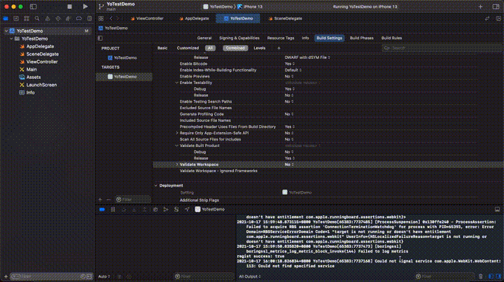
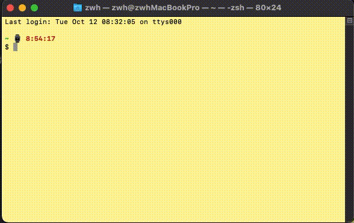

YoTest-iOS-SDK 文档
----

[](https://img.shields.io/cocoapods/v/YoTestSDK.svg)

> 基于虚拟机保护、设备特征识别和操作行为识别的新一代智能验证码，具备智能评分、抗 Headless、模拟伪装、针对恶意设备自动提升验证难度等多项安全措施，帮助开发者减少恶意攻击导致的数字资产损失，强力护航业务安全。

* [仓库入口](https://github.com/YoTest-team/YoTest-iOS-SDK#%E4%BB%93%E5%BA%93%E5%85%A5%E5%8F%A3)
* [兼容性](https://github.com/YoTest-team/YoTest-iOS-SDK#%E5%85%BC%E5%AE%B9%E6%80%A7)
* [示例项目](https://github.com/YoTest-team/YoTest-iOS-SDK#%E7%A4%BA%E4%BE%8B%E9%A1%B9%E7%9B%AE)
* [安装](https://github.com/YoTest-team/YoTest-iOS-SDK#%E5%AE%89%E8%A3%85)
* [自定义编译](https://github.com/YoTest-team/YoTest-iOS-SDK#%E8%87%AA%E5%AE%9A%E4%B9%89%E7%BC%96%E8%AF%91)
* [快速开始](https://github.com/YoTest-team/YoTest-iOS-SDK#%E5%BF%AB%E9%80%9F%E5%BC%80%E5%A7%8B)
* [API](https://github.com/YoTest-team/YoTest-iOS-SDK#api)

### 仓库入口：
<a href="https://gitee.com/yo-test-team/yo-test-i-os-sdk"></a>&nbsp;&nbsp;
<a href="https://github.com/YoTest-team/YoTest-iOS-SDK"></a>

### 兼容性

* iOS >= 9.0
* Swift（若需要使用OC，可以自行添加桥接代码）

### 示例项目
你可以通过 XCode 13+ 打开本项目进行示例项目的预览和更改，具体文件请[点击此处](https://github.com/YoTest-team/YoTest-iOS-SDK/tree/main/Demo)。

### 安装

#### 方法一，使用 [xcframework](https://github.com/bielikb/xcframeworks)（推荐）
	
下载 YoTest-iOS-SDK 最新 Tag 代码，将 [YoTest-iOS-SDK/Product](https://github.com/YoTest-team/YoTest-iOS-SDK/tree/main/Product/YoTestSDK.xcframework) 文件夹下的 YoTestSDK.xcframework 以及 WebRTC.framework 拖到您的工程目录里，并将动态库设置成 Embed&Sign，操作如下所示：
	


#### 方法二，使用 [CocoaPods](https://cocoapods.org/)

在 Podfile 中添加`pod 'YoTestSDK', '1.0.1'`并执行 `pod insall` 进行安装。

### 自定义编译

若有自定义更改SDK的需求，你可将仓库克隆到本地，自行修改后执行编译脚本打包，操作如下：

```shell
> git clone https://github.com/YoTest-team/YoTest-iOS-SDK.git
> cd YoTest-iOS-SDK
> ./build.sh
```



编译好后，可以按照 [安装](https://github.com/YoTest-team/YoTest-iOS-SDK#%E5%AE%89%E8%A3%85) 中的步骤，添加到工程项目中。

### 快速开始

第一步，克隆最新 Tag 代码，下载好后按照 [安装](https://github.com/YoTest-team/YoTest-iOS-SDK#%E5%AE%89%E8%A3%85) 中的步骤添加到工程项目中（若您使用的是 [CocoaPods](https://cocoapods.org/)，在 Podfile 中添加 `pod 'YoTestSDK', '1.0.1'`并执行 `pod insall` 进行安装）：

```shell
> git clone -b 1.0.1 --depth=1 https://github.com/YoTest-team/YoTest-iOS-SDK.git
```

第二步，在 Appdelegate 中添加注册 SDK 的代码，如图所示：

```swift
YoTest.registSDK(auth: .init(
    accessId: "填写项目的accessId，可在友验后台查看"
)) { success in
    print("regist success: \(success)")
}
```


第三步，在给验证码页面添加 `YoTestDelegate` 并实现以下代理方法：

```swift
func onSuccess(args: [String : Any]) {
    print("onSuccess args: \(args)")
}
    
func onReady(args: [String : Any]) {
    print("onReady args: \(args)")
}
    
func onShow(args: [String : Any]) {
    print("onShow args: \(args)")
}
    
func onClose(args: [String : Any]) {
    print("onClose args: \(args)")
    captcha?.close()
}
    
func onError(args: [String : Any]) {
    print("onError args: \(args)")
}
```

第四步，在需要弹出验证的逻辑中加入声明属性 `var captcha: YoTest?` 代码：

```swift
if captcha == nil {
    do {
        captcha = try YoTest(with: self)
    } catch {
        print("error: \(error)")
    }
}
captcha?.verify()
```

### API

YoTest类：

* [public static func registSDK(auth, on)](https://github.com/YoTest-team/YoTest-iOS-SDK#public-static-func-registsdkauth-yotestauth-on-escaping-bool---void)
* [public static func destroy()](https://github.com/YoTest-team/YoTest-iOS-SDK#public-static-func-destroy)
* [public init(with:) throws](https://github.com/YoTest-team/YoTest-iOS-SDK#public-initwith-yotestdelegate-throws)
* [public func verify()](https://github.com/YoTest-team/YoTest-iOS-SDK#public-func-verify)
* [public func close()](https://github.com/YoTest-team/YoTest-iOS-SDK#public-func-close)
* [public func cancel()](https://github.com/YoTest-team/YoTest-iOS-SDK#public-func-cancel)
* [public weak var delegate: YoTestDelegate?](https://github.com/YoTest-team/YoTest-iOS-SDK#public-weak-var-delegate-yotestdelegate)
* [public var autoShowLoading: Bool](https://github.com/YoTest-team/YoTest-iOS-SDK#public-var-autoshowloading-bool)
* [public var autoShowToast: Bool](https://github.com/YoTest-team/YoTest-iOS-SDK#public-var-autoshowtoast-bool)

YoTest.Auth结构体：

* [public init(accessId:)](https://github.com/YoTest-team/YoTest-iOS-SDK#public-initaccessid-string)

YoTest.YTError：

* [public let code: Code](https://github.com/YoTest-team/YoTest-iOS-SDK#public-let-code-code)

YoTest.YTError.Code枚举：

* [case requesting](https://github.com/YoTest-team/YoTest-iOS-SDK#public-func-onreadyargs-string-any)
* [case unavailable](https://github.com/YoTest-team/YoTest-iOS-SDK#public-func-onreadyargs-string-any)

YoTestDelegate协议：

* [public func onReady(args:)](https://github.com/YoTest-team/YoTest-iOS-SDK#public-func-onreadyargs-string-any)
* [public func onSuccess(args:)](https://github.com/YoTest-team/YoTest-iOS-SDK#public-func-onsuccessargs-string-any)
* [public func onShow(args:)](https://github.com/YoTest-team/YoTest-iOS-SDK#public-func-onshowargs-string-any)
* [public func onError(args:)](https://github.com/YoTest-team/YoTest-iOS-SDK#public-func-onerrorargs-string-any)
* [public func onClose(args:)](https://github.com/YoTest-team/YoTest-iOS-SDK#public-func-oncloseargs-string-any)

### **YoTest：**

#### public static func registSDK(auth: YoTest.Auth, on: @escaping (Bool) -> Void)
- auth \<YoTest.Auth\>
- on \<@escaping (Bool) -> Void\> 注册完成结果回调，成功返回true，否则返回false

注册SDK，需要在使用SDK进行人机验证前调用。可以添加到AppDelegate中，启动 App 时注册

```swift
func application(_ application: UIApplication, didFinishLaunchingWithOptions launchOptions: [UIApplication.LaunchOptionsKey: Any]?) -> Bool {
    // Override point for customization after application launch.
    ...    
    YoTest.logLevel = .verbose
    YoTest.registSDK(auth: .init(accessId: "在这里填写你的accessId")) { success in
        print("regist success: \(success)")
    }
    ...
    return true
}
```

#### public static func destroy()

销毁资源。不再使用SDK时，可以调用 YoTest.destroy() 方法来回收部分资源

```swift
/// 不再使用时
YoTest.destroy()
```

#### public init(with: YoTestDelegate?) throws

- with \<YoTestDelegate\>
- throws \<YTError\>

初始化 YoTest 实例对象。

```swift
do {
    let captcha = try YoTest(with: nil)
} catch {
    print("error: \(error)")
}
```

#### public func verify()

调起验证界面

```swift
do {
    let captcha = try YoTest(with: nil)
    captcha.verify()
} catch {
    print("error: \(error)")
}
```

#### public func close()

关闭验证界面。在 YoTestDelegate 的 onClose 方法回调时调用 close() 方法

```swift
class YourClass: NSObject, YoTestDelegate {
...
var captcha: YoTest?
...
func onClose(args: [String : Any]) {
    captcha?.close()
}
...
}
```

#### public func cancel()

取消验证。

```swift
class YourClass: NSObject, YoTestDelegate {
...
var captcha: YoTest?
...
func cancelVerify() {
    captcha?.cancel()
}
...
```

#### public weak var delegate: YoTestDelegate?

代理对象的获取和设置

```swift
class YourClass: NSObject, YoTestDelegate {
...
var captcha: YoTest?
...
func setDelegate() {
	captcha?.delegate = self
}
...
```

#### public var autoShowLoading: Bool

是否显示 SDK 提供的 loading，默认为true，可以设置为false来关闭

```swift
class YourClass: NSObject, YoTestDelegate {
...
var captcha: YoTest?
...
func dontShowLoading() {
	captcha?. autoShowLoading = false
}
...
```

#### public var autoShowToast: Bool

是否显示SDK提供的Toast，默认为true，可以设置为false来关闭

```swift
class YourClass: NSObject, YoTestDelegate {
...
var captcha: YoTest?
...
func dontShowToast() {
	captcha?.autoShowToast = false
}
...
```

### **YoTest.Auth：**

#### public init(accessId: String)

- accessId \<String\> 友验后台申请的accessId

初始化 Auth 对象。

```swift
YoTest.Auth(accessId: "友验后台申请的 accessId")
```

### **YoTest.YTError.Code：**

#### public let code: Code

错误码类型请参考如下表格：

|      错误码         |    描述   |
| ------------- | ---------- |
|    case requesting   |  正在请求授权 |
|    case unavailable  |  服务不可用，请检查accessId是否正确或网络是否正常 |

### **YoTestDelegate：**

#### public func onReady(args: [String: Any])

验证已准备就绪的回调

```swift
class YourClass: NSObject, YoTestDelegate {
...
func onReady(args: [String: Any]) {
	// 在这里实现自己的代码逻辑
}
...
```

#### public func onSuccess(args: [String: Any])

验证成功时的回调

```swift
class YourClass: NSObject, YoTestDelegate {
...
func onReady(args: [String: Any]) {
	// 在这里实现自己的代码逻辑
}
...
```

#### public func onShow(args: [String: Any])

验证弹框即将显示的回调

```swift
class YourClass: NSObject, YoTestDelegate {
...
func onShow(args: [String: Any]) {
	// 在这里实现自己的代码逻辑
}
...
```

#### public func onError(args: [String: Any])

验证错误回调

```swift
class YourClass: NSObject, YoTestDelegate {
...
func onError(args: [String: Any]) {
	// 在这里实现自己的代码逻辑
}
...
```

#### public func onClose(args: [String: Any])

验证关闭时回调

```swift
class YourClass: NSObject, YoTestDelegate {
...
var captcha: YoTest?
...
func onClose(args: [String: Any]) {
    // 记得调用 captcha.close()
    captcha?.close()
    // 在这里实现自己的代码逻辑
}
...
```
